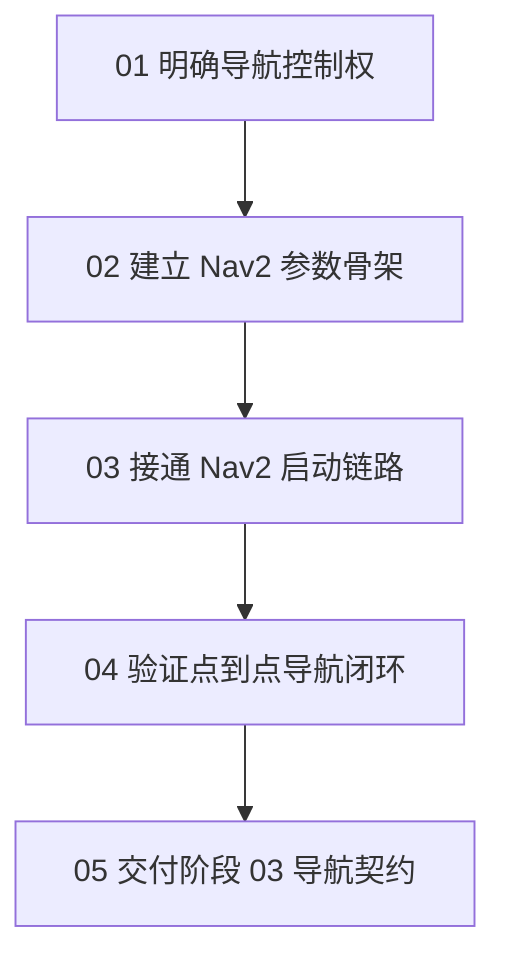

# 阶段 02：Nav2 导航接入

## 本阶段目标

本阶段把阶段 01 的 SLAM、`/map`、`/odom`、`base_link` 和 `/scan` 接到 Nav2，让机器人具备点到点导航能力。

完成本阶段后，系统应能通过 Nav2 的 `NavigateToPose` action 接收目标点，基于 `map`、rolling costmap 和激光障碍物规划路径，并通过 `/cmd_vel_smoothed` 桥接到 Gazebo 控制小车。

## 为什么现在做

自主探索不能直接控制速度，它需要一个可以执行目标点、反馈成功失败并处理避障的导航层。Nav2 是 `03-边界探索` 的直接前置能力：探索模块只负责选择 frontier 目标，目标执行交给 Nav2。

## 本阶段章节



阅读顺序：

- `01-隔离旧控制链路.md`：先解释为什么 Nav2 必须拥有独立速度链路，并逐步把 Gazebo bridge 交给 `/cmd_vel_smoothed`。
- `02-增加-Nav2-参数.md`：从 frame 约定开始，逐步构造 controller、costmap、planner、smoother 和 collision monitor 参数。
- `03-增加-Nav2-启动入口.md`：从空 launch 文件开始，逐步加入路径解析、launch 参数、仿真、SLAM、Nav2、RViz 和依赖检查。
- `04-验证-lifecycle-与目标入口.md`：把运行验证拆成 lifecycle、action、速度链路、`/odom` 移动证明和 `map -> base_link` 目标误差证明。
- `05-交付阶段-03-契约.md`：把阶段 03 可以依赖的 action、坐标、成功、失败、取消和超时语义收束成契约。

## 最少需要先读

- `../reference/dependencies.md`
- `../reference/control-ownership.md`
- `../reference/nav2-contract.md`
- `../reference/file-plan.md`
- `../reference/final-runtime/README.md`
- `../evidence/reference-runtime.patch`

## 本阶段已落地文件

- `src/kibot_one_sim/CMakeLists.txt`
- `src/kibot_one_sim/config/nav2_params.yaml`
- `src/kibot_one_sim/config/ros_gz_bridge.yaml`
- `src/kibot_one_sim/launch/gazebo.launch.py`
- `src/kibot_one_sim/launch/nav2.launch.py`
- `src/kibot_one_sim/launch/sim_with_bridge.launch.py`
- `src/kibot_one_sim/package.xml`
- `src/kibot_one_sim/scripts/check_nav2_runtime_deps.sh`

## 成品一致性要求

本阶段不是只要求“写出一套能跑的近似配置”。阶段 02 已有成品分支：

```text
feat/02-Nav2-导航接入
```

读者按本 roadmap 从共同 baseline 手写完成后，runtime 文件相对 baseline 的 diff 必须与 `../evidence/reference-runtime.patch` 完全一致。只有 `docs/` 下的差异可以不同。

成品 runtime 文件完整副本放在：

```text
../reference/final-runtime/src/kibot_one_sim/
```

章节正文用增量片段解释为什么这样写；最终合并结果以 `final-runtime/` 中的同名文件为准。换句话说，读者可以先按章节理解和手写，再用 `final-runtime/` 做逐文件核对，最后用 `reference-runtime.patch` 做 patch 级审计。

共同 baseline：

```text
e9b6fa40f7b269d098611b64f983d914f916b84e
```

对齐检查命令见 `../evidence/usage.md` 的“runtime patch 完全一致审计”。如果这个审计不通过，即使某次 launch 或短目标碰巧通过，也不能宣称本阶段文档复测通过。

## 使用方式

先检查 Nav2 运行依赖：

```bash
source .vscode/project-terminal-init.sh
src/kibot_one_sim/scripts/check_nav2_runtime_deps.sh
```

检查通过后，再构建并加载环境：

```bash
source .vscode/project-terminal-init.sh
colcon build --packages-select kibot_one_sim
source install/setup.bash
```

只看 launch 参数：

```bash
ros2 launch kibot_one_sim nav2.launch.py --show-args
```

启动仿真、SLAM 和 Nav2：

```bash
ros2 launch kibot_one_sim nav2.launch.py
```

`nav2.launch.py` 默认会用 `run_on_start:=true` 让 Gazebo 以 `-r` 运行，确保 `/odom` 和 `/tf` 能开始发布。

Nav2 的速度链路是：

```text
controller_server / behavior_server
  -> /cmd_vel_nav
  -> velocity_smoother
  -> /cmd_vel_smoothed
  -> ros_gz_bridge
  -> /model/kibot_one_base/cmd_vel
```

不要再把 Gazebo bridge 接到 `/cmd_vel` 来验证 Nav2；当前 Nav2 验收以 `/cmd_vel_smoothed` 为 Gazebo 控制入口。

`nav2.launch.py` 也默认启用 `check_runtime_deps:=true`。如果依赖检查失败，launch 会在启动 Nav2 前给出安装命令；先按 `../reference/dependencies.md` 安装或升级依赖，不要继续调 Nav2 参数。

如只想验证 Nav2 参数和 lifecycle，不启动 Gazebo：

```bash
ros2 launch kibot_one_sim nav2.launch.py start_sim:=false start_slam:=false use_rviz:=false
```

## 完成后应该观察到什么

- Nav2 lifecycle nodes 被自动激活。
- `/navigate_to_pose` action 存在。
- `/local_costmap/costmap` 和 `/global_costmap/costmap` 有数据。
- 发送目标点后，Nav2 通过 `/cmd_vel_smoothed` 输出速度，Gazebo `/odom` 实际前进。
- 旧的 `mode_control`、`follow_controller` 和 `cmd_vel_watchdog` 不在 `nav2.launch.py` 中启动。

## 系统预期状态

阶段 02 完成后，系统应该处在这个状态：

- 用户可以用 `ros2 launch kibot_one_sim nav2.launch.py use_rviz:=false` 一次启动 Gazebo、bridge、SLAM 和 Nav2。
- `/clock` 只有一个 publisher；如果出现多个 publisher，说明有残留仿真进程，不能继续判断导航行为。
- `controller_server`、`planner_server`、`bt_navigator`、`waypoint_follower` 等 Nav2 lifecycle node 进入 `active [3]`。
- `/navigate_to_pose` 可以接收 `nav2_msgs/action/NavigateToPose` 目标。
- Nav2 的速度输出经 `/cmd_vel_smoothed` 进入 `kibot_one_bridge`，再桥接到 Gazebo 的 `/model/kibot_one_base/cmd_vel`。
- 在默认障碍物世界中，发送一个近距离可达目标，例如 `map` 坐标 `(0.5, 0.0)`，应返回 `SUCCEEDED`；`/odom` 能看到机器人实际前进，`map -> base_link` 能看到机器人接近目标坐标。

这个状态证明的是“Nav2 点到点导航入口已经接通，并能执行局部可达目标”。它不是完整自主探索，也不是任意远端目标的可达性保证。

## 完成边界

本阶段可以承诺：

- Nav2 可以启动、激活并暴露 `/navigate_to_pose`。
- Gazebo、SLAM、TF、costmap、controller 和 velocity smoother 可以在同一个 launch 入口下协同工作。
- 阶段 03 可以把“已判定为局部可达的探索目标”交给 `/navigate_to_pose` 执行。
- 目标执行结果可以用于阶段 03 判断成功、失败或需要重新选点。

本阶段不承诺：

- 不承诺任意 `map` 绝对坐标都能到达。
- 不承诺穿过障碍物带的远端目标稳定成功。
- 不承诺 `NavigateToPose` 等价于“相对机器人当前位置向前走 N 米”。
- 不承诺已经具备 frontier 发现、目标排序、失败重试策略或多 waypoint 编排；这些属于阶段 03。

特别注意这个目标：

```bash
ros2 action send_goal /navigate_to_pose nav2_msgs/action/NavigateToPose \
  "{pose: {header: {frame_id: map}, pose: {position: {x: 5.0, y: 0.0, z: 0.0}, orientation: {w: 1.0}}}}"
```

它不是阶段 02 的冒烟测试。`frame_id: map` 表示 `(5.0, 0.0)` 是地图绝对坐标，不是“向前 5m”。在默认 `kibot_one_obstacles.world.sdf` 中，这个点位于障碍物带后方，路径会经过或绕过 `x≈1.10,y≈0.10` 和 `x≈2.45,y≈0.10` 附近的箱体障碍。

如果该目标返回：

```text
Goal finished with status: ABORTED
error_code: 105
```

应该判读为：Nav2 action server 已经接入，但路径跟随阶段没有稳定取得进展。`105` 对应 `FollowPath` 的 `FAILED_TO_MAKE_PROGRESS`，不是依赖缺失，也不是 `/navigate_to_pose` 没启动。

阶段 02 的可靠验收目标是近距离局部可达点，例如 `(0.5, 0.0)`；更长距离目标应该由 RViz 在当前可见空旷区域内选择，或由阶段 03 拆成可恢复的 waypoint。

## 下一阶段依赖契约

阶段 03 可以依赖：

- `/navigate_to_pose` action 存在，并使用 `nav2_msgs/action/NavigateToPose`。
- 目标坐标使用 `map` frame。
- `map -> base_link` 可用于判断机器人在地图中的当前位置。
- 局部可达目标成功时，action 返回 `SUCCEEDED` 和 `error_code: 0`。
- 目标执行失败时，阶段 03 应把该候选 frontier 降权或冷却，而不是立即认定系统不可用。
- 任务状态变化或视觉发现目标时，阶段 03 可以取消当前 navigation goal。

阶段 03 不应该依赖：

- controller、planner、costmap 插件的内部参数。
- `/cmd_vel_smoothed` 的具体数值作为业务状态。
- collision monitor 的日志作为探索决策来源。

## 下一节入口

本阶段通过至少 `checklist/low.md` 后，可以进入 `03-边界探索` 的文档设计；通过 `checklist/medium.md` 后，再实现 frontier 目标发送。
