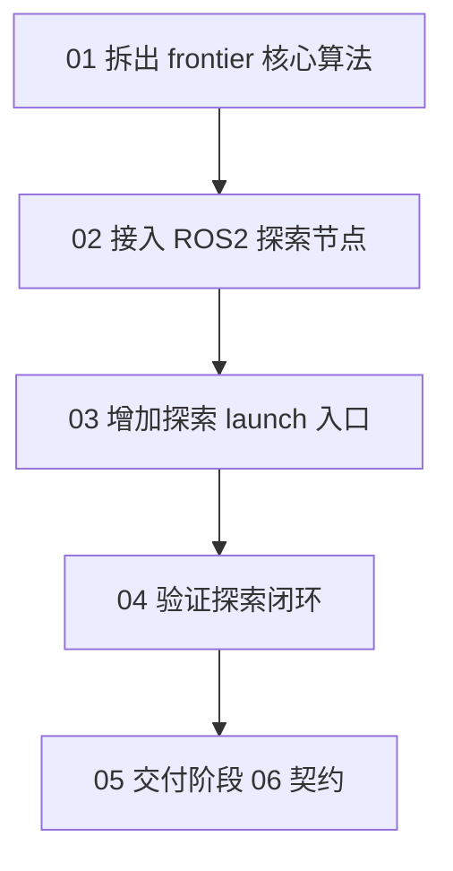

# 阶段 03：边界探索

## 本阶段目标

本阶段把阶段 02 已经验证的点到点导航能力，升级成“机器人能自己选择下一个探索目标”。

完成后，系统新增一个 `frontier_explorer` 节点：它订阅 `/map`，用 `map -> base_link` 判断机器人当前位置，从 OccupancyGrid 中提取未知区域和已知空闲区域的边界，把候选目标发送到 `/navigate_to_pose`，并根据成功、拒绝、失败或超时继续选择下一个 frontier。

## 为什么现在做

阶段 02 已经证明 Nav2 可以执行局部可达的 `map` 坐标目标。探索模块不应该重新做避障和路径跟随；它只负责回答一个问题：

```text
当前地图里，哪个已知空闲侧的 frontier 目标最值得交给 Nav2？
```

## 本阶段章节



阅读顺序：

- `01-拆出-frontier-核心算法.md`：先把 OccupancyGrid 到 frontier candidate 的转换写成可单测函数。
- `02-接入-ROS2-探索节点.md`：再把 `/map`、TF 和 `/navigate_to_pose` action 接进节点。
- `03-增加探索-launch-入口.md`：给探索阶段提供一个包含 Nav2 bringup 和 explorer 的启动入口。
- `04-验证探索闭环.md`：跑编译、单测、launch 冒烟和短时仿真，确认目标能被发送并成功执行。
- `05-交付阶段-06-契约.md`：说明任务状态机后续可以依赖哪些探索行为。

## 最少需要先读

- `../../02-Nav2-导航接入/roadmap/05-交付阶段-03-契约.md`
- `../reference/frontier-contract.md`
- `../reference/file-plan.md`
- `../reference/final-runtime/README.md`
- `../evidence/usage.md`

## 本阶段已验证的 runtime 文件

- `src/kibot_one_control/kibot_one_control/frontier_core.py`
- `src/kibot_one_control/kibot_one_control/frontier_explorer.py`
- `src/kibot_one_control/launch/frontier_exploration.launch.py`
- `src/kibot_one_control/test/test_frontier_core.py`
- `src/kibot_one_control/package.xml`
- `src/kibot_one_control/setup.py`

## 实现边界说明

本阶段的实现从纯算法开始，再接入 ROS2 节点，最后补齐 launch 入口和分层验证。这个顺序把问题拆成三个层次：

- 算法层只处理 OccupancyGrid 数据、frontier 分组、free-side goal 和冷却过滤。
- 节点层只处理 `/map`、`map -> base_link` 和 `/navigate_to_pose` 三个运行时接口。
- launch 层只复用阶段 02 的 Nav2 bringup，并增加探索节点开关。

这样写完后，学生可以先用单测确认 frontier 选择契约，再用 launch 冒烟和短时仿真确认 ROS2 runtime 已经接通。

## 系统预期状态

阶段 03 完成后，系统应该处在这个状态：

- `frontier_explorer` 可以随 Nav2、SLAM 和 Gazebo 一起启动。
- `/map` 出现后，探索节点能找到未知区域和已知空闲区域的边界。
- 探索目标发送到 `/navigate_to_pose`，坐标系是 `map`。
- goal 位置落在 frontier 的已知空闲侧，而不是未知栅格内部。
- 成功目标会释放当前 goal，继续寻找下一个 frontier。
- 被拒绝、失败或超时的 frontier 会进入冷却，避免马上重复发送同一个目标。

## 完成边界

本阶段可以承诺：

- 第一版 frontier 提取、分组、评分和冷却策略已经有单测覆盖。
- 探索节点能在完整仿真中发出 frontier goal，并观察到 Nav2 至少完成一个目标。
- launch 入口可以复用阶段 02 的 Nav2 bringup。
- 阶段 06 可以通过取消当前 Nav2 goal 来中断探索。

本阶段不承诺：

- 不承诺整张地图覆盖率最优。
- 不承诺所有狭窄区域都能探索完成。
- 不承诺探索完成判定已经产品化；当前只在没有可用候选时记录日志。
- 不处理视觉旗帜发现后的任务切换；那属于阶段 04 和阶段 06。

## 失败判读

- 如果第一次 goal 被 Nav2 拒绝，但随后 lifecycle active 后能重新发送并成功，属于可接受的启动竞态；冷却机制应避免高频重复。
- 如果一直显示 `waiting for /map`，先检查阶段 01 的 SLAM 和 `/scan`。
- 如果一直显示等待 `map -> base_link`，先检查 TF 和 SLAM lifecycle。
- 如果 action server 不存在，回到阶段 02 验证 `/navigate_to_pose`。
- 如果 goal 总是 `ABORTED`，优先用 RViz 判断该 frontier 的 free-side goal 是否真的局部可达，再决定是否需要调整 explorer 的距离参数或候选选择策略。

## 下一阶段依赖契约

阶段 06 可以依赖：

- 探索入口是 `frontier_explorer`。
- 探索目标通过 `/navigate_to_pose` 执行。
- 当前探索 goal 可以被取消。
- 探索失败不等于任务失败；失败 frontier 会冷却，节点会尝试其他候选。

阶段 06 不应该依赖：

- frontier 评分公式的具体权重。
- Nav2 controller 的内部日志。
- `frontier_explorer` 日志文本作为状态机输入。

## 下一节入口

从 `01-拆出-frontier-核心算法.md` 开始。先写能单测的地图算法，再接 ROS2 runtime。
