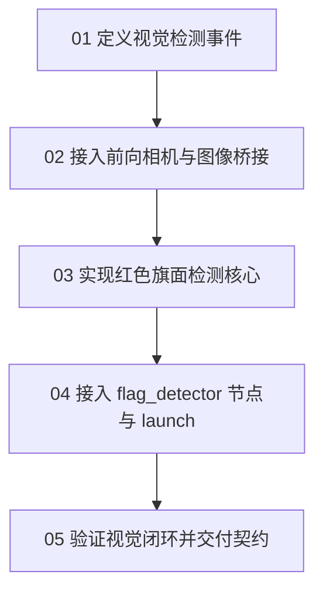

# 阶段 04：视觉旗帜检测

## 本阶段目标

本阶段让机器人第一次通过相机看到旗帜，并把图像观测转换成 `/flag_detection` 事件。

完成后，系统会新增一个前向 RGB camera、一个图像 bridge、一个 `FlagDetection` 消息和一个 `flag_detector` 节点。后续任务状态机可以先采用“发现即停止”的策略，而不再把 Gazebo 提供的 `/flag_pose` 当作任务输入。

## 为什么现在做

阶段 03 已经能让机器人主动探索未知区域。探索本身不回答“什么时候找到旗帜”；这个判断应该来自传感器观测，而不是 Gazebo 直接发布的全局真值。

本阶段只处理视觉发现事件：

```text
/camera/image_raw -> flag_detector -> /flag_detection
```

这一阶段的工程重点是把输入来源从“仿真真值”切换到“相机观测”。旗帜在 `map` 或 `world` 中的位置估计需要相机模型、测距或几何推断，留给阶段 05 扩展。

## 本阶段章节



建议按下面顺序阅读和实践。每一节都只引入下一步必须用到的接口或文件，让问题保持可定位：

- `01-定义视觉检测事件.md`：先定义阶段 06 可以消费的检测消息。
- `02-接入前向相机与图像桥接.md`：再让 Gazebo camera 图像进入 ROS2。
- `03-实现红色旗面检测核心.md`：把图像 bytes 到检测结果的判断做成可单测纯函数。
- `04-接入-flag-detector-节点与-launch.md`：把纯函数接入 ROS2 节点并提供启动入口。
- `05-验证视觉闭环并交付契约.md`：运行构建、测试、topic 和消息验证，并说明阶段 05 / 06 可以依赖什么。

## 最少需要先读

- `../../00-系统基线/flag-pose-flow.md`
- `../reference/vision-contract.md`
- `../reference/file-plan.md`
- `../reference/dependencies.md`
- `../evidence/usage.md`

## 本阶段已验证的 runtime 文件

- `src/kibot_one_interface/msg/FlagDetection.msg`
- `src/kibot_one_interface/CMakeLists.txt`
- `src/kibot_one_interface/package.xml`
- `src/kibot_one_sim/models/kibot_one_base/model.sdf`
- `src/kibot_one_sim/config/ros_gz_bridge.yaml`
- `src/kibot_one_control/kibot_one_control/flag_detection_core.py`
- `src/kibot_one_control/kibot_one_control/flag_detector.py`
- `src/kibot_one_control/launch/flag_detection.launch.py`
- `src/kibot_one_control/test/test_flag_detection_core.py`
- `src/kibot_one_control/setup.py`

## 系统预期状态

阶段 04 完成后，系统应该处在这个状态：

- Gazebo 机器人模型有 `camera_link` 和一个前向 RGB camera。
- ROS2 中可以看到 `/camera/image_raw`。
- `flag_detector` 订阅 `/camera/image_raw`。
- `flag_detector` 发布 `/flag_detection`，类型是 `kibot_one_interface/msg/FlagDetection`。
- 旗帜进入视野时，至少一帧检测消息的 `detected=true`。
- 检测消息使用图像像素描述目标，不携带 Gazebo world 位姿。

## 完成边界

本阶段交付的是第一条视觉发现链路：

- 建立第一版 RGB 颜色检测链路。
- 输出可供阶段 06 做“发现即停止”的事件。
- 输出足够阶段 05 继续做方向或位置估计的图像中心、尺寸、像素数和置信度。
- `/flag_pose` 不再是后续 mission 的输入契约。

下面这些能力会在后续章节按工程依赖继续展开：

- 复杂光照、遮挡和多目标场景下的鲁棒检测，需要更完整的视觉算法或数据驱动方法。
- 旗帜相对 `base_link`、`map` 或 `world` 的三维位置，需要阶段 05 引入方向、距离和坐标变换。
- 检测事件接入任务状态机，属于阶段 06 的任务编排工作。
- `/flag_pose` 继续保留为 debug 对照，帮助比较视觉观测和仿真真值。

## 失败判读

- 看不到 `/camera/image_raw`：优先检查 SDF camera topic 和 `ros_gz_bridge.yaml` 是否一致。
- 看得到 `/camera/image_raw` 但看不到 `/flag_detection`：检查 `flag_detector` console script、launch 安装和节点日志。
- `/flag_detection` 一直 `detected=false`：先确认旗帜是否在 camera 视野中，再调 `min_red`、`red_margin` 或 `min_pixel_count`。
- `colcon test` 显示 `NO TESTS RAN`：这是当前包的测试发现配置尚未接入 `colcon`；阶段 04 的算法层先用直接 pytest 命令验收。
- 完成判断以实际收到图像消息为准；只有 topic 名出现在列表里还不足以证明相机链路已经工作。

## 下一阶段依赖契约

阶段 05 可以依赖：

- `/flag_detection.header.frame_id` 表示图像帧，预期为 `camera_link`。
- `center_x`、`center_y` 是图像像素质心。
- `image_width`、`image_height` 是当前图像尺寸。
- `pixel_count` 和 `confidence` 可以作为检测质量参考。

阶段 06 可以依赖：

- `detected=true` 表示当前帧看到足够大的红色旗面。
- `detected=false` 表示当前帧没有满足阈值的红色旗面。
- 任务状态机可以先用“检测到即取消探索并停止”的策略。

阶段 05 / 06 的依赖边界：

- 任务输入使用 `/flag_detection`，`/flag_pose` 只作为 debug 对照。
- `confidence` 作为检测质量参考，具体阈值可以随后续算法和场景调整。
- 任务状态条件依赖消息语义，不依赖 `flag_detector` 内部红色阈值。

## 下一节入口

从 `01-定义视觉检测事件.md` 开始。先把事件契约固定下来，再接传感器和算法。
