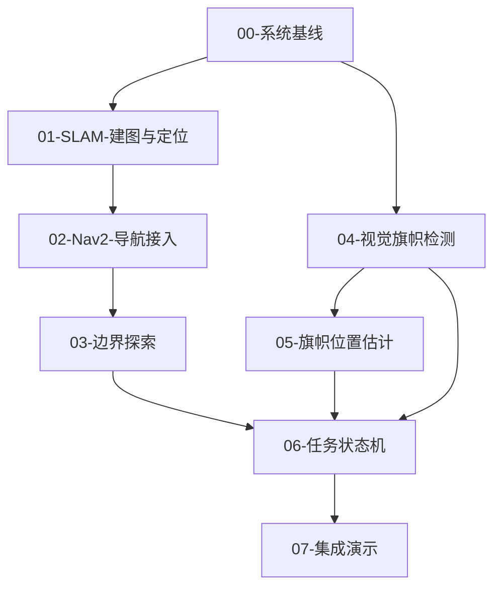
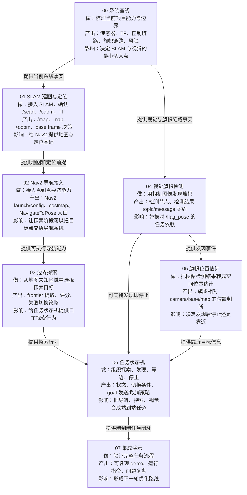

# 路线图：自主探索与旗帜寻找

## 目标结果

KiBotTwo 从“读取外部发布的旗帜位姿”演进为“自主探索未知封闭空间、通过视觉发现旗帜、并完成靠近或停止任务”的系统。

最终系统不应把旗帜位姿当作已知环境信息，而应将旗帜作为运行时感知目标。

## 当前路线状态

当前阶段：`01-SLAM-建图与定位`

| 阶段 | 状态 | 依赖 | 阶段产出 |
| --- | --- | --- | --- |
| 00-系统基线 | 已完成 | 无 | 当前系统能力边界和数据流 |
| 01-SLAM-建图与定位 | 已计划 | 00-系统基线 | 可用的 SLAM 建图与定位链路 |
| 02-Nav2-导航接入 | 受阻 | 01-SLAM-建图与定位 | Nav2 接入计划与可执行点到点导航系统 |
| 03-边界探索 | 受阻 | 02-Nav2-导航接入 | 可自动选择探索目标的探索模块 |
| 04-视觉旗帜检测 | 受阻 | 00-系统基线 | 不依赖旗帜全局位姿的视觉检测模块 |
| 05-旗帜位置估计 | 受阻 | 04-视觉旗帜检测 | 可用于靠近任务的旗帜位置估计 |
| 06-任务状态机 | 受阻 | 03-边界探索、04-视觉旗帜检测 | 探索、发现、靠近、停止的任务状态机 |
| 07-集成演示 | 受阻 | 06-任务状态机 | 端到端演示与复盘 |

## 路线依赖图



## 阶段影响图

这张图用于回答“每个阶段在整个 roadmap 中做什么，以及它如何影响后续阶段”。每个节点都是一个阶段，不是 ROS2 node；箭头表示前一阶段的产出会成为后一阶段的输入或约束。



## 阶段 00：系统基线

状态：`已完成`

阶段目的：

- 明确当前项目已经具备什么能力。
- 找出当前“直接发布旗帜位姿”的数据路径。
- 确认后续 SLAM、Nav2、视觉模块接入的真实工程入口。

进入条件：

- 项目可以正常构建，或至少可以启动当前仿真。
- 能访问当前 package、launch、URDF/Xacro、world、节点代码和接口定义。

阶段产出：

- 当前 ROS2 graph 的概要记录。
- 当前 TF tree 的概要记录。
- 当前传感器列表。
- 当前旗帜位姿发布和消费链路。
- 后续阶段的实现风险清单。

完成条件：

- 能说明当前小车如何移动。
- 能说明当前旗帜信息如何进入任务逻辑。
- 能说明当前是否已有 lidar、camera、odom、imu、TF。
- 能决定 `01-SLAM-建图与定位` 和 `04-视觉旗帜检测` 的最小切入点。

后续阶段：

- `01-SLAM-建图与定位`
- `04-视觉旗帜检测`

## 阶段 01：SLAM 建图与定位

状态：`已计划`

依赖阶段：

- `00-系统基线`

阶段目的：

- 引入或整理 SLAM 链路。
- 建立 `map -> odom -> base_link` 的定位基础。
- 让小车在未知环境中生成可用于导航的地图。

阶段产出：

- SLAM launch / config 方案。
- 可在 RViz 中观察的 map。
- 稳定的 TF 链路。
- 对 lidar / odom 数据质量的判断。

完成条件：

- 小车移动时地图可以持续更新。
- `map`、`odom`、`base_link` 的 TF 关系清晰且无冲突。
- 生成的地图足够支持 Nav2 costmap。

后续阶段：

- `02-Nav2-导航接入`

## 阶段 02：Nav2 导航接入

状态：`受阻`

依赖阶段：

- `01-SLAM-建图与定位`

阶段文档：

- `02-Nav2-导航接入/路线图.md`
- `02-Nav2-导航接入/验收条件.md`
- `02-Nav2-导航接入/文件计划.md`
- `02-Nav2-导航接入/接口契约.md`
- `02-Nav2-导航接入/运行时检查清单.md`
- `02-Nav2-导航接入/记录与复盘.md`

阶段目的：

- 引入 Nav2 点到点导航能力。
- 让小车能够在地图和 costmap 基础上执行目标点导航。
- 为 `03-边界探索` 提供 `NavigateToPose` action 入口。

阶段产出：

- Nav2 bringup 方案。
- planner / controller / costmap 的最小配置。
- 可通过 RViz 或 action client 发送目标点。
- 阶段 03 调用 Nav2 的接口契约。

完成条件：

- 小车能接收 `NavigateToPose` 目标。
- 小车能规划路径并尝试到达目标点。
- 障碍物和未知区域在 costmap 中表现合理。
- 能明确成功、失败、取消和超时结果如何反馈给探索模块。

后续阶段：

- `03-边界探索`

阻塞说明：

- 02 的文档可以先完成。
- 02 的功能实现必须等待 01 确认 `/map`、`map -> odom`、base frame、`/scan` 和 `/cmd_vel` 链路。

## 阶段 03：边界探索

状态：`受阻`

依赖阶段：

- `02-Nav2-导航接入`

阶段目的：

- 让小车从“被动接收目标点”升级为“主动选择探索目标”。
- 使用 frontier 或等价策略驱动未知空间探索。

阶段产出：

- frontier 提取策略。
- frontier 评分和过滤策略。
- 向 Nav2 发送探索目标的模块设计。
- 探索失败和目标不可达处理策略。

完成条件：

- 小车能在没有人工目标点的情况下探索未知空间。
- 探索目标不会明显重复或频繁震荡。
- 遇到不可达目标时能切换到其他目标。

后续阶段：

- `06-任务状态机`

## 阶段 04：视觉旗帜检测

状态：`受阻`

依赖阶段：

- `00-系统基线`

阶段目的：

- 通过相机图像发现旗帜。
- 移除任务逻辑对旗帜全局位姿输入的依赖。

阶段产出：

- 旗帜视觉检测方案。
- 检测结果 topic / message 设计。
- 第一版检测节点的输入输出契约。

完成条件：

- 旗帜进入视野时能发布检测结果。
- 旗帜离开视野时能恢复未检测状态。
- 检测结果与任务决策解耦。

后续阶段：

- `05-旗帜位置估计`
- `06-任务状态机`

## 阶段 05：旗帜位置估计

状态：`受阻`

依赖阶段：

- `04-视觉旗帜检测`

阶段目的：

- 将图像中的旗帜检测转化为机器人可用的空间位置估计。
- 判断第一版任务应采用“发现即停止”还是“发现后靠近”。

阶段产出：

- 旗帜位置估计策略。
- 坐标系转换链路。
- 检测抖动和丢失目标处理策略。

完成条件：

- 能给出旗帜相对 `base_link` 或 `camera_link` 的估计。
- 如需要全局导航，能转换到 `map` 坐标系。
- 能明确估计误差对靠近任务的影响。

后续阶段：

- `06-任务状态机`

## 阶段 06：任务状态机

状态：`受阻`

依赖阶段：

- `03-边界探索`
- `04-视觉旗帜检测`

可选依赖：

- `05-旗帜位置估计`

阶段目的：

- 将探索、视觉发现、靠近旗帜和停止行为组织成明确状态机。
- 避免探索逻辑、视觉逻辑和导航逻辑互相耦合。

阶段产出：

- 任务状态定义。
- 状态切换条件。
- Nav2 goal 发送、取消和切换策略。
- 误检、目标丢失、导航失败、超时的处理规则。

完成条件：

- 小车可从 `EXPLORING` 切换到旗帜相关状态。
- 检测到旗帜后不会继续盲目探索。
- 停止条件明确且可复现。

后续阶段：

- `07-集成演示`

## 阶段 07：集成演示

状态：`受阻`

依赖阶段：

- `06-任务状态机`

阶段目的：

- 完成从启动仿真到任务结束的端到端闭环。
- 记录系统能力边界、失败模式和下一轮优化方向。

阶段产出：

- 一套可复现的 demo 流程。
- RViz 可视化配置。
- 运行指令。
- 已知问题列表。
- 下一版路线图候选项。

完成条件：

- 在未知封闭空间中，小车能开始探索。
- 旗帜位置变化后，小车仍能通过视觉发现旗帜。
- 小车能按当前策略靠近或停下。
- 不依赖直接发布的旗帜全局位姿完成任务。

## 路线图更新规则

- 只有当前阶段可以进入 `进行中`。
- 阶段完成后，再创建或补全下一阶段的详细 roadmap。
- 如果某阶段发现前置假设错误，应回到依赖阶段更新结论。
- 每个阶段结束时，必须记录新的风险、取舍和下一步入口。

## 阶段状态说明

```text
已计划    尚未开始，但已进入近期计划
进行中    当前正在推进
受阻      等待依赖阶段完成
已完成    已达到完成条件
暂缓      暂时不做，但不阻塞主线
返工      已完成过，但需要重新调整
```
