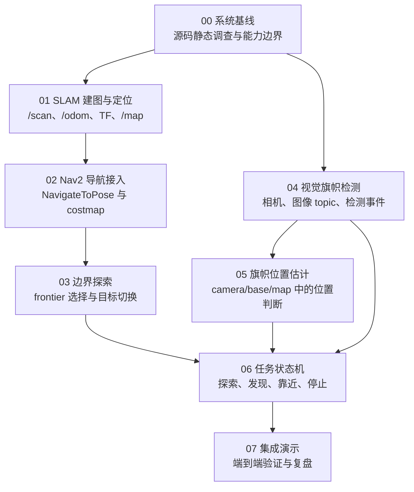

# 自主探索与视觉寻找旗帜路线图

## 目标结果

这套路线图用于把 KiBotTwo 从“读取外部发布的旗帜位姿并跟随”推进到“在未知封闭空间中自主探索、通过视觉发现旗帜，并按任务策略停止或靠近旗帜”。

最终系统应满足三个核心变化：

- 不再把 `/flag_pose` 当作任务输入的真值来源。
- 使用 SLAM、Nav2 和探索策略让机器人主动覆盖未知空间。
- 使用相机感知旗帜，并由任务状态机协调探索、发现、靠近或停止。

## 当前推进位置

当前 part：`04-视觉旗帜检测`（待展开）

当前路线刚完成边界探索文档复测闭环。`00-系统基线` 已完成源码静态调查；`01-SLAM-建图与定位` 已有 SLAM 启动与参数基础；`02-Nav2-导航接入` 已通过完整仿真验收：Nav2 lifecycle active、costmap 正常发布、`NavigateToPose` 返回成功，并确认 Gazebo `/odom` 随目标执行前进。`03-边界探索` 已通过探针和严格 sub agent 复测：独立复测者只按 `roadmap/` 步骤手写 runtime，运行构建、单测、launch、无仿真冒烟和 35s 完整仿真，最终非 `docs/` patch 与 `evidence/reference-runtime.patch` 字节级一致。

`00` 和 `01` 仍保留旧版平铺文件结构；从 `02` 开始使用 `roadmap/`、`reference/`、`checklist/`、`evidence/` 四类子目录。

## 推荐阅读顺序

1. 先读本文件，确认总目标、当前 part 和依赖关系。
2. 读 `00-系统基线/roadmap.md`，理解当前系统已有能力和边界。
3. 查阅 `00-系统基线/system-inventory.md` 与 `00-系统基线/flag-pose-flow.md`，确认现有 topic、控制链路和旗帜位姿链路。
4. 进入 `01-SLAM-建图与定位/roadmap.md`，确认 SLAM、TF 和 `/map` 前置条件。
5. 进入 `02-Nav2-导航接入/roadmap/index.md`，按阶段 02 的章节推进。
6. 使用 `02-Nav2-导航接入/checklist/low.md`、`medium.md`、`high.md` 分层验收。
7. 进入 `03-边界探索/roadmap/index.md`，按阶段 03 的章节推进。
8. 使用 `03-边界探索/checklist/low.md`、`medium.md`、`high.md` 分层验收。

## Part 状态表

| Part | 状态 | 依赖 | 当前文档 | 解锁内容 |
| --- | --- | --- | --- | --- |
| `00-系统基线` | 已完成 | 无 | 已存在 | 解锁 SLAM 与视觉检测的切入点 |
| `01-SLAM-建图与定位` | 已接入，待运行时确认 | `00-系统基线` | 已存在 | 解锁 Nav2、后续探索和全局坐标中的旗帜估计 |
| `02-Nav2-导航接入` | 已完成 | `01-SLAM-建图与定位` | 已存在 | 解锁点到点导航和探索目标执行 |
| `03-边界探索` | 已完成 | `02-Nav2-导航接入` | 已存在 | 解锁未知空间主动探索 |
| `04-视觉旗帜检测` | 未开始 | `00-系统基线` | 未展开 | 解锁不依赖 `/flag_pose` 的旗帜发现事件 |
| `05-旗帜位置估计` | 阻塞 | `04-视觉旗帜检测` | 未展开 | 解锁发现后靠近旗帜或转换到地图坐标系 |
| `06-任务状态机` | 阻塞 | `04-视觉旗帜检测`，可复用 `03-边界探索` | 未展开 | 解锁探索、发现、靠近、停止的端到端任务编排 |
| `07-集成演示` | 阻塞 | `06-任务状态机` | 未展开 | 解锁可复现 demo、复盘和下一轮优化路线 |

## Part 依赖图

## Part 说明

### 00-系统基线

目的：

- 梳理当前 package、launch、Gazebo world、bridge、接口和控制节点。
- 找出当前 `/flag_pose` 如何产生、如何被消费，以及它为什么不能作为最终任务输入。
- 判断 SLAM、Nav2、视觉检测和任务状态机的真实接入点。

依赖：

- 无。

产出：

- 当前系统能力边界。
- 当前 topic、service、传感器、控制链路和旗帜链路记录。
- 后续阶段风险清单。

完成条件：

- 能说明小车如何被 `/cmd_vel` 控制。
- 能说明 `/scan`、`/odom`、`/robot_pose`、`/flag_pose` 在当前系统中的作用。
- 能指出当前缺少相机、SLAM、Nav2、`map` frame 和自主探索能力。
- 能给阶段 01 和阶段 04 提供最小切入点。

解锁内容：

- `01-SLAM-建图与定位`
- `04-视觉旗帜检测`

### 01-SLAM-建图与定位

目的：

- 基于现有 `/scan` 和 `/odom` 接入 SLAM。
- 明确并补齐 `map -> odom -> base_link -> lidar_link` 或等价 TF 链路。
- 让后续 Nav2 可以依赖地图、定位和机器人 base frame。

依赖：

- `00-系统基线`

产出：

- 运行时 topic、header 和 TF 记录。
- SLAM 启动与配置方案。
- RViz 中可观察的 `/map`、激光和机器人 frame。
- 阶段 02 所需的 Nav2 frame/topic 前置条件。

完成条件：

- `/scan` 和 `/odom` 稳定可用。
- SLAM 能发布 `/map`。
- `map -> odom` 可用。
- 机器人 base frame 与 `lidar_link` 的 TF 可用。
- RViz 中地图、激光和机器人位置关系基本正确。
- 已明确 Nav2 后续应使用的 `global_frame`、`odom_frame`、`robot_base_frame`、scan topic 和 `/cmd_vel` 策略。

解锁内容：

- `02-Nav2-导航接入`
- 为 `05-旗帜位置估计` 提供将目标转换到 `map` 坐标系的基础。

### 02-Nav2-导航接入

目的：

- 接入 Nav2 点到点导航能力。
- 让机器人可以接收目标点、规划路径并通过 `/cmd_vel_smoothed` 输出速度控制。
- 为边界探索提供可执行的 `NavigateToPose` 入口。

依赖：

- `01-SLAM-建图与定位`

产出：

- Nav2 bringup 和参数文件。
- planner、controller、costmap 的最小配置。
- 目标发送、成功、失败、取消和超时的接口约定。
- Nav2 与现有 `cmd_vel_watchdog`、模式系统之间的控制权策略。

完成条件：

- 可以通过 RViz 或 action client 发送导航目标。
- Nav2 能规划路径并到达短距离目标，`/odom` 能证明机器人实际移动。
- costmap 对障碍物和未知区域的表现可解释。
- 探索模块能可靠读取导航结果。

解锁内容：

- `03-边界探索`

### 03-边界探索

目的：

- 让机器人从人工目标点导航升级为主动选择探索目标。
- 使用 frontier 或等价策略从地图未知区域中挑选下一目标。

依赖：

- `02-Nav2-导航接入`

产出：

- frontier 提取、过滤和评分策略。
- 探索目标发送策略。
- 不可达、重复目标、震荡和超时处理规则。
- `frontier_explorer` 节点、探索 launch 入口和核心算法单测的探针实现。

完成条件：

- 机器人能在没有人工目标点的情况下持续探索未知空间。
- 探索目标不会明显重复或频繁震荡。
- 遇到不可达目标时能切换到其他候选目标。
- 探针验证中至少一个 frontier goal 通过 Nav2 返回成功。

解锁内容：

- `06-任务状态机`

### 04-视觉旗帜检测

目的：

- 给机器人建立视觉输入。
- 通过图像检测旗帜，产生“发现旗帜”的运行时事件。
- 移除任务逻辑对 `/flag_pose` 的依赖。

依赖：

- `00-系统基线`

产出：

- 相机传感器和 ROS2 图像 topic。
- 旗帜检测节点的输入输出契约。
- 检测结果 topic 或 message 设计。
- 误检、漏检、目标离开视野时的状态规则。

完成条件：

- 旗帜进入视野时能发布检测结果。
- 旗帜离开视野时能恢复未检测状态。
- 检测输出不携带 Gazebo 直接提供的旗帜全局位姿。
- 任务逻辑可以只依赖检测事件做第一版“发现即停止”。

解锁内容：

- `05-旗帜位置估计`
- `06-任务状态机`

### 05-旗帜位置估计

目的：

- 把视觉检测结果转成机器人可用的空间判断。
- 决定第一版任务采用“发现即停止”，还是支持“发现后靠近”。

依赖：

- `04-视觉旗帜检测`

产出：

- 旗帜相对 `camera_link`、`base_link` 或 `map` 的估计策略。
- 深度、单目测距或多帧估计的取舍记录。
- 检测抖动、目标丢失和估计误差处理规则。

完成条件：

- 能输出足够稳定的旗帜方向或位置判断。
- 如果需要全局导航靠近，能把目标转换到 `map` 坐标系。
- 能说明估计误差会如何影响停止距离或靠近策略。

解锁内容：

- `06-任务状态机`

### 06-任务状态机

目的：

- 把探索、视觉发现、靠近或停止组织成明确状态流。
- 避免探索逻辑、视觉逻辑和导航控制互相耦合。

依赖：

- `03-边界探索`
- `04-视觉旗帜检测`

可选依赖：

- `05-旗帜位置估计`

产出：

- 任务状态定义。
- 状态切换条件。
- Nav2 goal 发送、取消和替换策略。
- 误检、目标丢失、导航失败、超时的处理规则。

完成条件：

- 机器人可从 `EXPLORING` 切换到旗帜相关状态。
- 检测到旗帜后不会继续盲目探索。
- 停止或靠近条件明确且可复现。
- 旧 `/flag_pose` 链路不再决定任务成功。

解锁内容：

- `07-集成演示`

### 07-集成演示

目的：

- 把启动仿真、建图定位、导航探索、视觉发现和任务结束串成可复现演示。
- 记录当前系统能力边界、失败模式和下一轮优化方向。

依赖：

- `06-任务状态机`

产出：

- 端到端 demo 启动流程。
- RViz 可视化配置。
- 验证命令和观察点。
- 已知问题与下一轮路线候选项。

完成条件：

- 在未知封闭空间中，机器人能开始探索。
- 旗帜位置变化后，机器人仍能通过视觉发现旗帜。
- 机器人能按当前策略停止或靠近。
- 演示过程不依赖直接发布的旗帜全局位姿。

解锁内容：

- 下一版性能、鲁棒性和真实机器人迁移路线。

## 状态值与更新规则

状态值：

| 状态 | 含义 |
| --- | --- |
| 未开始 | part 已在总路线中，但没有展开详细材料 |
| 进行中 | 当前正在推进，允许继续补充 roadmap、reference、checklist 或 evidence |
| 已接入，待运行时确认 | 代码或文档入口已存在，但完整仿真验收还没有通过 |
| 已完成 | 已达到该 part 的完成条件，并记录了对后续 part 的影响 |
| 需要返工 | 已完成过，但发现前置假设、接口或验收结果需要调整 |
| 阻塞 | 依赖 part 尚未完成，不能进入正式实现引导 |

更新规则：

- 同一时间只把一个主线 part 标为 `进行中`。
- 完成一个 part 后，先更新本文件的状态表，再展开下一个 part 的详细文档。
- 如果运行时事实推翻了已有判断，回到对应依赖 part 更新结论，不把错误假设继续传给后续 part。
- 未来 part 在展开前只保留目的、依赖、产出和完成条件，不提前写成已经验证过的方案。
- 具体实现引导阶段应补充 evidence；顶层规划阶段不默认创建探针分支。
